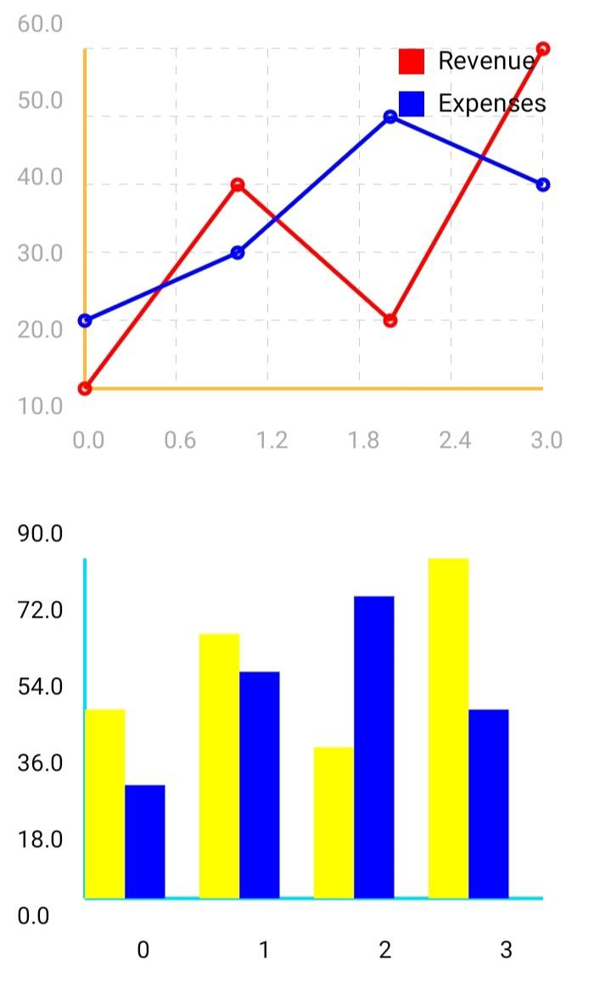
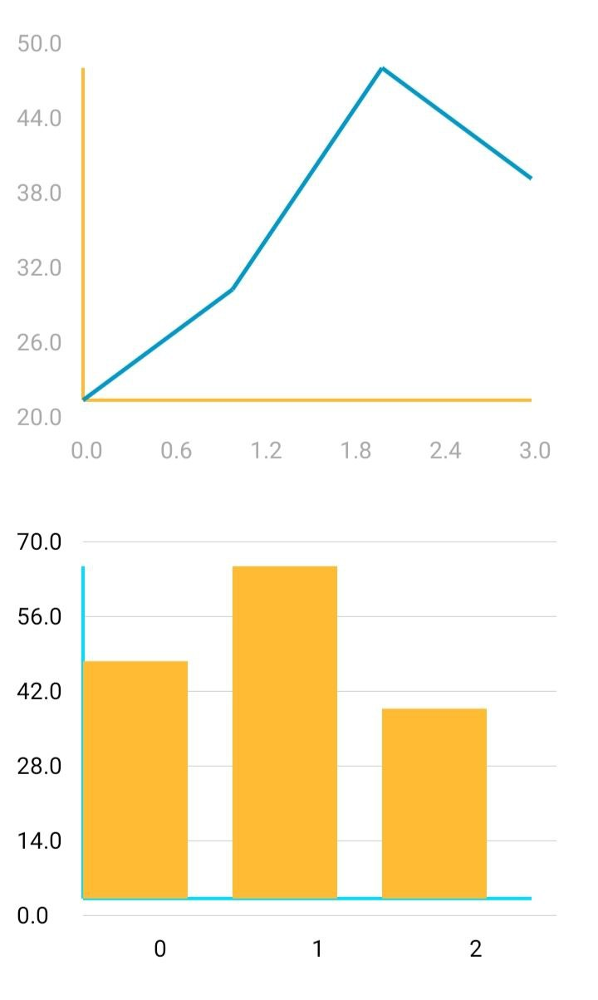
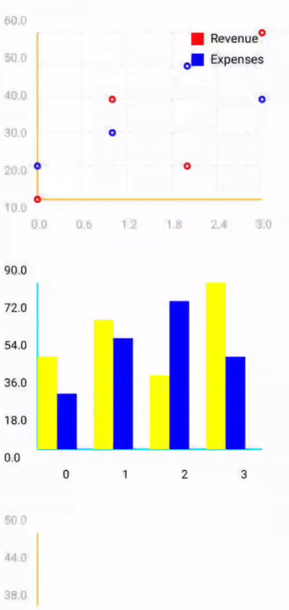

## GraphView – Android Custom Chart Library (Kotlin)
[](https://kotlinlang.org/)
[](LICENSE)
[](#)
---

It is designed to be:

- Easy to use
- XML-friendly
- Flexible for single or multiple datasets
- Suitable for dashboards, analytics, and reports

---

## Features

### Line Graph

- Single or multiple lines
- Smooth animated drawing
- Touch tooltip (x, y values)
- Legend support
- Grid lines
- XML & code based styling

### Bar Graph

- Single or grouped bars
- Touch tooltip
- Legend support
- Grid lines
- XML & code based styling

### Styling

- Set colors from XML or Kotlin
- Axis color
- Text color
- Line / Bar color
- Show / hide grid
- Show / hide legend

### Smart Behavior

- XML color used when code color is not provided
- Code color overrides XML
- Safe padding (no clipping on edges)
- Clean API for beginners & advanced users

--- 

## Preview

<p align="center">
<table>
  <tr>
    <td align="center">
      
    </td>
    <td align="center">
      
    </td>
  </tr>
</table>
</p>



---

## Installation (JitPack)

### 1️⃣ Add JitPack to your **root `settings.gradle` or `build.gradle`**

```gradle
dependencyResolutionManagement {
    repositories {
        google()
        mavenCentral()
        maven { url 'https://jitpack.io' }
    }
}
```
### Add Dependency
```
dependencies {
	        implementation 'com.github.Excelsior-Technologies-Community:Android_GraphView:1.0.0'
	}
```

---

## Usage

### XML Usage(Line Graph)
```xml
<com.ext.graphview.LineGraphView
    android:id="@+id/lineGraph"
    android:layout_width="match_parent"
    android:layout_height="300dp"
    app:lineColor="@android:color/holo_blue_dark"
    app:axisColor="@android:color/holo_orange_light"
    app:textColor="@android:color/darker_gray"
    app:showGrid="true"
    app:showLegend="true"/>
```

### kotlin Usage (Single Line)
```kotlin
lineGraph.setLine(
    LineData(
        xValues = listOf(0f, 1f, 2f, 3f),
        yValues = listOf(10f, 40f, 20f, 60f),
        label = "Revenue"
    )
)
```
###kotlin usage (Multiple Lines)
```kotlin
lineGraph.setLines(
    listOf(
        LineData(
            xValues = listOf(0f, 1f, 2f, 3f),
            yValues = listOf(10f, 40f, 20f, 60f),
            color = Color.RED,
            label = "Revenue"
        ),
        LineData(
            xValues = listOf(0f, 1f, 2f, 3f),
            yValues = listOf(20f, 30f, 50f, 40f),
            color = Color.BLUE,
            label = "Expenses"
        )
    )
)
```

### Bar Graph

**XML Udage**
```xml
<com.ext.graphview.BarGraphView
                android:id="@+id/bargraph"
                android:layout_width="match_parent"
                android:layout_height="300dp"
                app:axisColor="@android:color/holo_blue_bright"
                app:barColor="@android:color/holo_orange_light"
                app:showGrid="false"
                app:showLegend="true"
                app:textColor="@color/black" />
```

### kotlin Usage (Single Bar)
```kotlin
barGraph.setBar(
    LineData(
        xValues = listOf(0f, 1f, 2f),
        yValues = listOf(50f, 70f, 40f),
        label = "Sales"
    )
)
```

### Kotlin Usage (Multiple Bars)
```kotlin
barGraph.setBars(
    listOf(
        LineData(
            xValues = listOf(0f, 1f, 2f),
            yValues = listOf(50f, 70f, 40f),
            color = Color.RED,
            label = "Sales"
        ),
        LineData(
            xValues = listOf(0f, 1f, 2f),
            yValues = listOf(30f, 60f, 80f),
            color = Color.BLUE,
            label = "Expenses"
        )
    )
)
```

---

## XML Attributes

| Attribute | Type | Description |
|----------|------|-------------|
| `app:lineColor` | color | Default line color when not provided in Kotlin (default: Blue) |
| `app:barColor` | color | Default bar color when not provided in Kotlin (default: Blue) |
| `app:axisColor` | color | Color of X and Y axes (default: Black) |
| `app:textColor` | color | Color of axis labels and text (default: Black) |
| `app:showGrid` | boolean | Show or hide grid lines (default: `false`) |
| `app:showLegend` | boolean | Show or hide legend box (default: `true`) |

---

## License

```
MIT License

Copyright (c) 2025 Excelsior Technologies 

Permission is hereby granted, free of charge, to any person obtaining a copy
of this software and associated documentation files (the "Software"), to deal
in the Software without restriction, including without limitation the rights
to use, copy, modify, merge, publish, distribute, sublicense, and/or sell
copies of the Software, and to permit persons to whom the Software is
furnished to do so, subject to the following conditions:

The above copyright notice and this permission notice shall be included in all
copies or substantial portions of the Software.

THE SOFTWARE IS PROVIDED "AS IS", WITHOUT WARRANTY OF ANY KIND, EXPRESS OR
IMPLIED, INCLUDING BUT NOT LIMITED TO THE WARRANTIES OF MERCHANTABILITY,
FITNESS FOR A PARTICULAR PURPOSE AND NONINFRINGEMENT. IN NO EVENT SHALL THE
AUTHORS OR COPYRIGHT HOLDERS BE LIABLE FOR ANY CLAIM, DAMAGES OR OTHER
LIABILITY, WHETHER IN AN ACTION OF CONTRACT, TORT OR OTHERWISE, ARISING FROM,
OUT OF OR IN CONNECTION WITH THE SOFTWARE OR THE USE OR OTHER DEALINGS IN THE
SOFTWARE.
```


